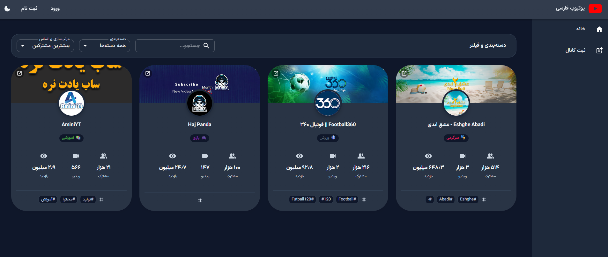
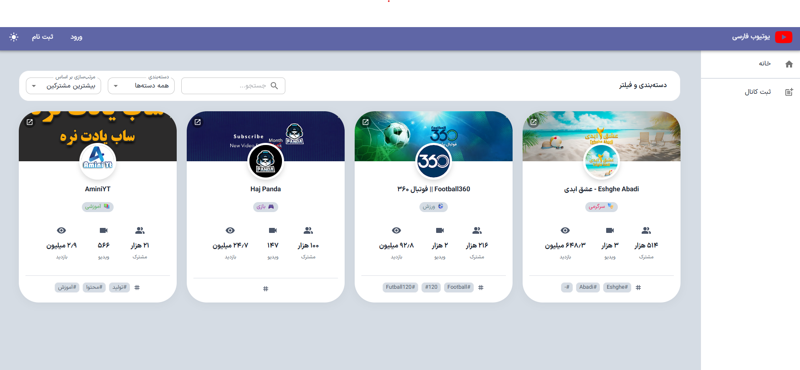
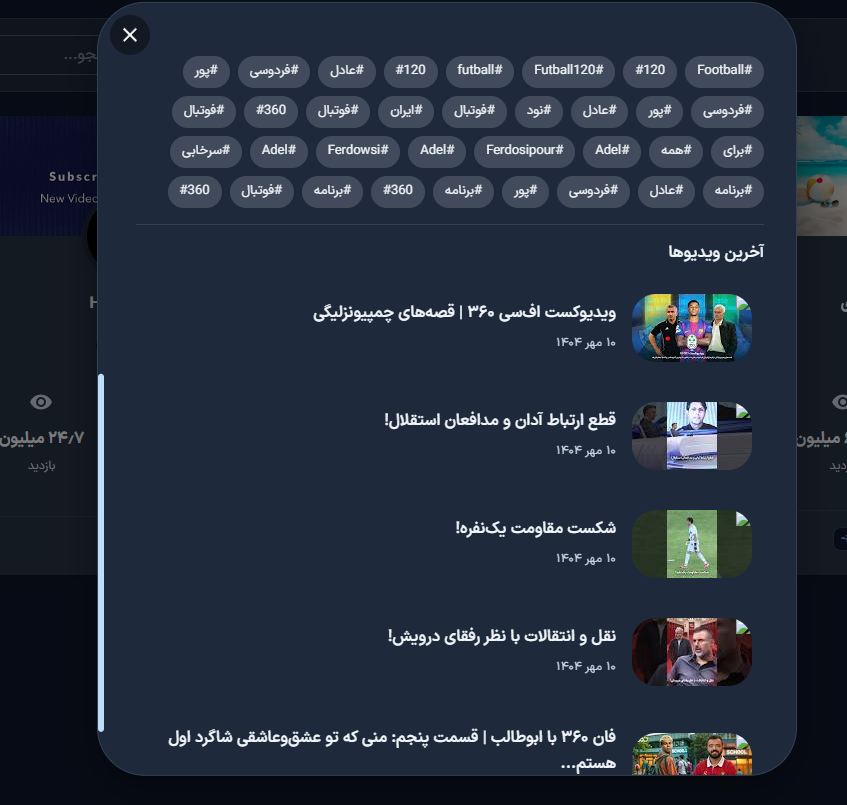
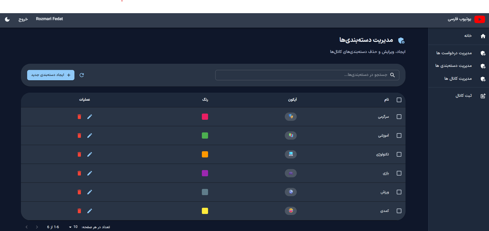
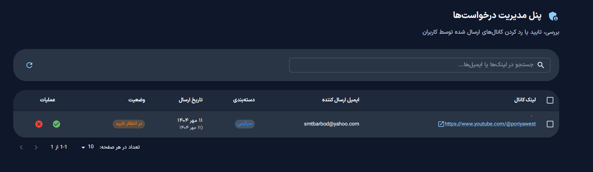
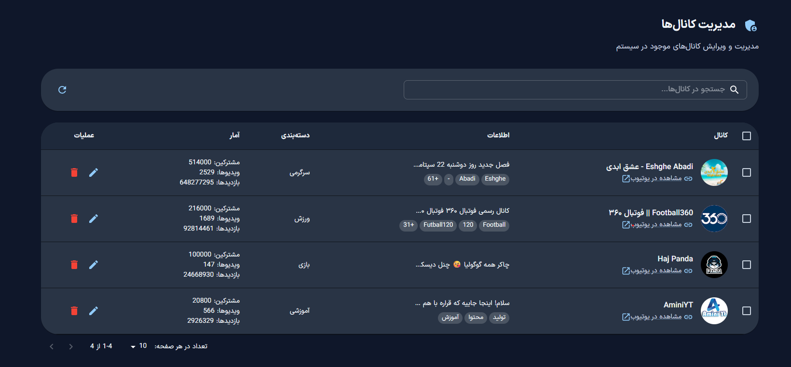
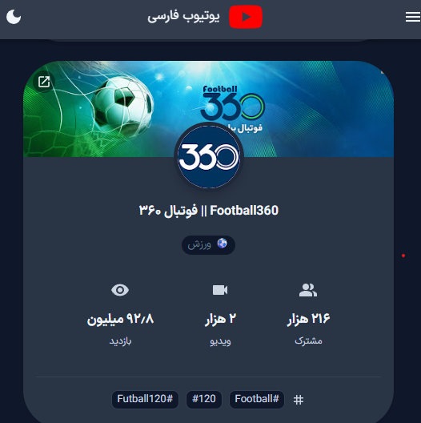
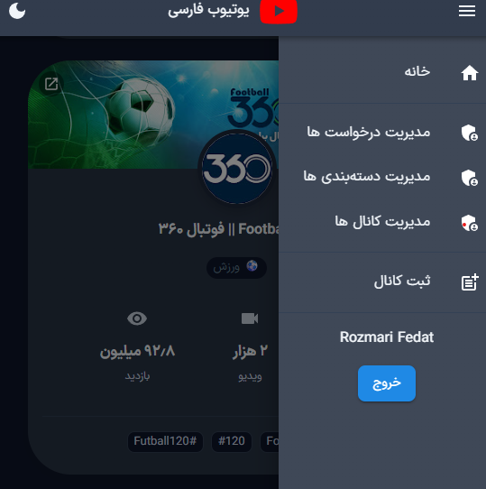

# 📖 کتابخانه کانال های یوتیوب فارسی (پروژه Full-Stack)

این یک پروژه کامل Full-Stack برای ساخت پلتفرم "کتابخانه یوتیوبرهای فارسی" است. هدف این پروژه، ایجاد یک مرجع کامل برای کشف و جستجوی کانال‌های یوتیوب فارسی‌زبان است که در آن کاربران می‌توانند کانال‌های جدید را ثبت کرده و ادمین‌ها بر محتوای سایت نظارت دارند.

---

### 🖼️ اسکرین‌شات‌های پروژه

<table>
  <tr>
    <td></td>
    <td></td>
    <td></td>
  </tr>
  <tr>
    <td></td>
    <td></td>
    <td></td>
  </tr>
  <tr>
    <td></td>
    <td></td>
    <td></td>
  </tr>
</table>
---

### ✨ ویژگی‌های کلیدی

#### **بخش کاربری (Frontend):**
* **طراحی مدرن و واکنش‌گرا:** رابط کاربری جذاب با استفاده از Material-UI که در تمام دستگاه‌ها به درستی نمایش داده می‌شود.
* **بارگذاری بهینه و سریع:** استفاده از **Server-Side Rendering (SSR)** در Next.js برای بهبود چشمگیر سرعت اولیه بارگذاری و سئو.
* **جستجو و فیلترینگ پیشرفته:** قابلیت جستجوی زنده (Live Search) و فیلتر کردن کانال‌ها بر اساس دسته‌بندی.
* **تجربه کاربری روان:** انیمیشن‌های ظریف با Framer Motion و مدیریت وضعیت (State) یکپارچه با Redux Toolkit.
* **بهینه‌سازی برای موتورهای جستجو (SEO):** تولید متادیتای داینامیک برای هر صفحه برای بهترین نتیجه در گوگل.

#### **بخش سرور (Backend):**
* **API قدرتمند و امن:** معماری مبتنی بر سرویس در ASP.NET Core برای ارائه یک API قابل اتکا.
* **احراز هویت مبتنی بر توکن:** سیستم امن ثبت‌نام، ورود و مدیریت جلسات با استفاده از **JWT**.
* **مدیریت نقش‌ها (Role-Based Access):** دسترسی‌های متفاوت برای کاربران عادی و ادمین‌ها.
* **به‌روزرسانی خودکار داده‌ها:** یک سرویس پس‌زمینه (Background Service) به طور منظم اطلاعات کانال‌ها را از **YouTube Data API** دریافت و به‌روزرسانی می‌کند.
* **ارسال ایمیل:** یکپارچه‌سازی با سرویس خارجی (Mailjet) برای ارسال ایمیل‌های ضروری مانند بازیابی رمز عبور.

---

### 🏗️ نگاهی به معماری پروژه

این پروژه با ساختار **Monorepo** مدیریت می‌شود که در آن کد فرانت‌اند و بک‌اند در یک ریپازیتوری واحد اما در فولدرهای مجزا قرار دارند.

* **Frontend (Next.js):** مسئولیت تمام بخش‌های دیداری، تجربه کاربری، و رندر اولیه سمت سرور را بر عهده دارد. این بخش از طریق API با بک‌اند ارتباط برقرار می‌کند.
* **Backend (ASP.NET Core):** به عنوان هسته مرکزی پروژه عمل می‌کند. مسئولیت منطق تجاری، مدیریت دیتابیس، احراز هویت کاربران و ارائه API به فرانت‌اند را بر عهده دارد.

این جداسازی، توسعه و نگهداری پروژه را آسان‌تر کرده و امکان توسعه مستقل هر بخش را فراهم می‌کند.

---

### 🛠️ تکنولوژی‌های استفاده شده

| بخش         | تکنولوژی                                                                        |
|-------------|---------------------------------------------------------------------------------|
| **Frontend** | Next.js, React, Redux Toolkit, RTK Query, Material-UI (MUI), Framer Motion, Zod |
| **Backend** | ASP.NET Core, Entity Framework Core, JWT, YouTube Data API, Mailjet API         |
| **Database** | [نام دیتابیس خود را اینجا بنویسید، مثال: PostgreSQL یا SQL Server]                      |

